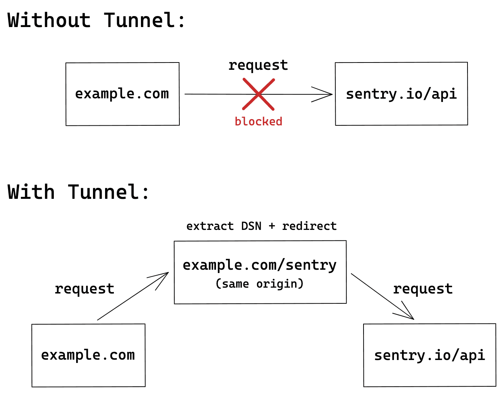

<h1 align="center">Sentry Tunnel Using NodeJS</h1>

# Dealing with Ad-Blockers

When you are using sentry CDN, ad-blocking or script-blocking extensions may prevent sentry SDK from being fetched and initialized properly. Because of this, any call to the SDKs API will fail and may cause your application to behave unexpectedly.

Additionally, even when the SDK is downloaded and initialized correctly, Sentry endpoints that need to receive captured data may be blocked as well. This prevents any error reports, sessions health, or performance data from being delivered, making it effectively unavailable in sentry.io.

Furthermore, some browsers, like [Brave](https://brave.com/), have built-in ad-blockers that may block requests sent to our endpoint. Even if users deactivate your domain from blocking, Brave might continue to block requests made from service workers.

# Using the `tunnel` Option

A tunnel is an HTTP endpoint that acts as a proxy between Sentry and your application. Because you control this server, there is no risk of any requests sent to it being blocked. When the endpoint lives under the same origin (although it does not have to in order for the tunnel to work), the browser will not treat any requests to the endpoint as a third-party request. As a result, these requests will have different security measures applied which, by default, don't trigger ad-blockers. A quick summary of the flow can be found below.




## For help getting started with Node and Express view online documentation

- [Node.js](https://nodejs.org/en/docs/)
- [Express.js](https://expressjs.com/)

# [Setup Node](https://nodejs.org/en/)

# 🛠️ Installation Steps

### Clone the repository ⎘
```bash
git clone https://github.com/asif-simform/sentry-tunnel-using-node.git

```

### Change the working directory 📂
```bash
cd sentry-tunnel-using-node
```

### Install dependency 🚚
```bash
yarn
```

### Start app 🚀
```bash
yarn start
```

You are all set! Open [localhost:3005](http://localhost:3005/) to see the app.
